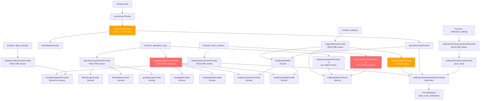

# Attendance AI — Single Source of Truth Architecture Map

> **Purpose:** Pre-fix reference document. No code is changed here.  
> **Codebase root:** `lib/`  
> **Date:** 2026-06-16

---

## PART 1 — COLLECTION & PROVIDER CLASSIFICATION

### Firestore Collections

| Collection | Path | Classification | Reasoning |
|---|---|---|---|
| `users` | `users/{uid}` | **Source of Truth** | Identity, preferences, premium status — nothing derives this |
| `subjects` | `users/{uid}/subjects` | **Source of Truth** (with denormalized counters) | Master record for subject identity. `attendedClasses` / `totalClasses` are denormalized summaries of `attendance_logs` — those counter fields are **Derived** |
| `timetable_entries` | `users/{uid}/timetable_entries` | **Source of Truth** | Weekly schedule template. The canonical definition of when a class repeats |
| `class_sessions` | `users/{uid}/class_sessions` | **Derived** | Generated from `timetable_entries` × `semesters`. Every session doc is a pre-expanded instance of an entry for a specific calendar date |
| `attendance_logs` | `users/{uid}/attendance_logs` | **Source of Truth** | Immutable audit record of attendance decisions. The only place a user's actual attend/absent choice is permanently recorded |
| `semesters` | `users/{uid}/semesters` | **Source of Truth** | Defines the date range used to generate `class_sessions` |
| `daily_overrides` | `users/{uid}/daily_overrides/{dateKey}/sessions` | **Source of Truth** | Per-day schedule edits. Not derivable from anything else |
| `notification_settings` | `users/{uid}/notification_settings/prefs` | **Source of Truth** | User notification preferences |
| `notification_alert_state` | `users/{uid}/notification_alert_state/{subjectId}` | **Derived / Cache** | Tracks whether a low-attendance alert has fired. Derived from subject attendance percentage vs. goal |
| `timetable` | `users/{uid}/timetable` | **Legacy / Deprecated** | Old collection used by `FirestoreDatasource.watchTimetable()`. New code uses `timetable_entries`. Both exist simultaneously with different structures |

---

### Riverpod Providers

| Provider | File | Classification | Reasoning |
|---|---|---|---|
| `currentUserProvider` | `auth_repository.dart` | **Source of Truth** | Wraps `FirebaseAuth.instance.currentUser` — the identity source |
| `authStateChangesProvider` | `auth_repository.dart` | **Source of Truth** (stream) | Auth state stream from Firebase |
| `userProfileProvider` | `profile_provider.dart` | **Cache** | One-shot `Future` fetch of `users/{uid}`. Not a stream — stale after write until `ref.invalidate()` |
| `attendanceGoalProvider` | `profile_provider.dart` | **Derived** | Derived from `userProfileProvider.valueOrNull?.attendanceGoal ?? 75.0` |
| `themeModeProviderProvider` | `profile_provider.dart` | **Derived** | Derived from `userProfileProvider` themeMode field |
| `firestoreDatasourceProvider` | `firestore_datasource.dart` | **Infrastructure** | Stateless Firestore wrapper, not classified as data |
| `subjectsStreamProvider` | `dashboard_provider.dart` | **Source of Truth** (stream) | Streams the master `subjects` collection |
| `subjectsNotifierProvider` | `subjects_provider.dart` | **Derived** | Wraps `subjectsStreamProvider` via an inline anonymous StreamProvider (anti-pattern) |
| `dashboardNotifierProvider` | `dashboard_provider.dart` | **Derived** | Derived from `subjectsStreamProvider` + `attendanceGoalProvider` |
| `todaySessionsStreamProvider` | `timetable_provider.dart` | **Source of Truth** (stream) | Streams today's `class_sessions` from Firestore |
| `todayOverridesStreamProvider` | `timetable_provider.dart` | **Source of Truth** (stream) | Streams today's `daily_overrides` from Firestore |
| `schedulePageDataProvider` | `timetable_provider.dart` | **Derived** | Merges sessions + overrides in memory, buckets by time |
| `clockTickProvider` | `timetable_provider.dart` | **Infrastructure** | Local `Stream.periodic` — not data |
| `attendanceLogsStreamProvider` | `attendance_history_provider.dart` | **Source of Truth** (stream) | Streams `attendance_logs` — one of TWO identical listeners |
| `analyticsLogsStreamProvider` | `analytics_provider.dart` | **Duplicate Cache** | ⚠️ Opens a SECOND independent stream on the SAME `attendance_logs` query |
| `filteredLogsProvider` | `attendance_history_provider.dart` | **Derived** | Filter + sort of `attendanceLogsStreamProvider` |
| `groupedLogsProvider` | `attendance_history_provider.dart` | **Derived** | Group-by-date of `filteredLogsProvider` |
| `filteredStatsProvider` | `attendance_history_provider.dart` | **Derived** | Aggregate counts from `filteredLogsProvider` |
| `subjectLogsStreamProvider(id)` | `subject_detail_provider.dart` | **Source of Truth** (stream) | Per-subject logs stream — separate query from the global log stream |
| `upcomingSessionsProvider(id)` | `subject_detail_provider.dart` | **Derived** (expensive) | Full-collection stream on `class_sessions WHERE subjectId == x`, filtered client-side |
| `subjectDetailProvider(id)` | `subject_detail_provider.dart` | **Derived** | Combines subject + logs + upcoming sessions |
| `analyticsPeriodNotifierProvider` | `analytics_provider.dart` | **UI State** | Period selector toggle — local UI state |
| `trendDataProvider` | `analytics_provider.dart` | **Derived** | Computed from `analyticsLogsStreamProvider` + period |
| `heatmapDataProvider` | `analytics_provider.dart` | **Derived** | Computed from `analyticsLogsStreamProvider` |
| `analyticsSummaryProvider` | `analytics_provider.dart` | **Derived** | Computed from `dashboardNotifierProvider` + `analyticsLogsStreamProvider` |
| `analyticsInsightsProvider` | `analytics_provider.dart` | **Derived** | Generated from subjects + logs + goal |
| `notificationPreferencesStreamProvider` | `notification_preferences_provider.dart` | **Source of Truth** (stream) | Streams `notification_settings/prefs` from Firestore |
| `notificationPreferencesProvider` | `notification_preferences_provider.dart` | **Cache** | Sync accessor: `streamProvider.valueOrNull ?? defaults()` |
| `notificationSchedulerWatcherProvider` | `notification_scheduler_provider.dart` | **Derived / Side-effect** | Watches multiple streams, triggers `rescheduleAll()` as a side effect |
| `subjectDetailPeriodNotifierProvider` | `subject_detail_provider.dart` | **UI State** | Weekly/monthly toggle |
| `attendanceFilterNotifierProvider` | `attendance_history_provider.dart` | **UI State** | History filter state |
| `scheduleNotifierProvider` | `timetable_provider.dart` | **UI State + Command** | Holds action status; executes attendance writes |
| `localCacheDatasourceProvider` | `local_cache_datasource.dart` | **Cache** | SharedPreferences wrapper |

---

## PART 2 — DEPENDENCY GRAPH

```
┌─────────────────────────────────┐
│  Firebase Auth                  │  currentUserProvider
│  (authStateChangesProvider)     │  → uid used everywhere
└──────────────┬──────────────────┘
               │ uid
               ▼
┌─────────────────────────────────┐
│  users/{uid}                    │  userProfileProvider (Future, NOT stream)
│  Source of Truth                │  → attendanceGoal, themeMode, isPremium
└──────────────┬──────────────────┘
               │ attendanceGoal
               ▼
┌─────────────────────────────────┐
│  SUBJECTS                       │
│  users/{uid}/subjects           │
│  Source of Truth                │
│  (subjectsStreamProvider)       │
└──────┬────────────────┬─────────┘
       │                │
       │ stream         │ counter fields
       ▼                ▼ (attendedClasses, totalClasses)
```

### Arrow 1: Subjects → Class Sessions

```
subjects/{id}  ──────────────────►  class_sessions/{id}
(name, subjectId)                   (subjectName, subjectId baked in at generation)
```

| Property | Value |
|---|---|
| **What updates it** | `TimetableRepository.saveClassSessions()` — run once when user sets up timetable. `addSessionsForEntry()` — run when a new timetable entry is added manually. |
| **What listens to it** | `todaySessionsStreamProvider` (Firestore real-time), `upcomingSessionsProvider(id)` |
| **Is update realtime?** | ✅ The stream is realtime. But the arrow itself (subject → session generation) is **a one-time batch write**, NOT realtime. If you rename a subject, the sessions are NOT regenerated. |
| **Can it become stale?** | ✅ YES. `class_sessions.subjectName` is baked in at write time. If `subjects.name` changes, every future session still shows the old name. The session document is only updated when attendance is marked (`status` field), never when the subject name changes. |

---

### Arrow 2: Class Sessions → Attendance Logs

```
class_sessions/{id}  ──────────────────►  attendance_logs/{id}
(subjectId, subjectName, startTime,        (subjectId, subjectName, startTime,
 endTime, date, status)                     endTime, date, sessionId, status)
```

| Property | Value |
|---|---|
| **What updates it** | `FirestoreDatasource.logAttendance()` (first mark) / `updateAttendanceLog()` (re-mark). Also `AttendanceNotificationActionHandler._markSession()` (background notification actions). |
| **What listens to it** | `attendanceLogsStreamProvider`, `analyticsLogsStreamProvider` (DUPLICATE), `subjectLogsStreamProvider(id)` |
| **Is update realtime?** | ✅ YES — stream updates push to all listeners within milliseconds of Firestore write. |
| **Can it become stale?** | ✅ YES for `subjectName`. The name is written once at mark time from `session.displaySubjectName`. If subject is renamed later, the log retains the old name. `subjectId` is always correct and can be used to look up current name. |

---

### Arrow 3: Attendance Logs → subjects (counter feedback loop)

```
attendance_logs  ──────────────────►  subjects/{id}
(log written)                          (attendedClasses++, totalClasses++)
```

| Property | Value |
|---|---|
| **What updates it** | `logAttendance()` batch: writes the log AND increments `subjects/{id}.attendedClasses` / `totalClasses` atomically. Same for `updateAttendanceLog()` (delta) and `deleteAttendanceLog()` (reverse). Also `AttendanceNotificationActionHandler._markSession()` runs a Firestore transaction doing the same. |
| **What listens to it** | `subjectsStreamProvider` — the subject document stream automatically emits when counters change |
| **Is update realtime?** | ✅ YES — batch/transaction completes, Firestore pushes updated subject doc to all listeners. |
| **Can it become stale?** | ⚠️ POTENTIAL DRIFT. The counters in `subjects` are NOT computed from logs — they are incremented manually with `FieldValue.increment()`. If a mark operation partially fails (e.g. log write succeeds but counter update fails due to network), the counter and log count will diverge permanently. There is no reconciliation job. |

---

### Arrow 4: Subjects → Dashboard

```
subjects (stream)  ──────────────────►  DashboardNotifier
(all subject docs)                       (overallPercentage, safeBunks, bunkStatus)
+ attendanceGoal (from userProfile)
```

| Property | Value |
|---|---|
| **What updates it** | Any change to any subject document (name, counters, timestamps) emits from `subjectsStreamProvider`, which triggers `DashboardNotifier.build()` to recompute. Also `attendanceGoalProvider` change (user updates goal) triggers recompute. |
| **What listens to it** | `DashboardScreen`, `analyticsSummaryProvider`, `analyticsInsightsProvider` |
| **Is update realtime?** | ✅ YES — subject counter updates arrive within ~1s of attendance mark |
| **Can it become stale?** | ⚠️ YES if `userProfileProvider` (Future, not stream) is stale. If user changes their goal in `ProfileNotifier.updateGoal()`, `ref.invalidate(userProfileProvider)` is called — but this re-fetches once and doesn't create a live stream. Between the invalidation and the refetch, dashboard shows the old goal. |

---

### Arrow 5: Subjects + Logs → Analytics

```
subjects (via dashboardNotifier)  ──────────────────►  AnalyticsSummary
attendance_logs (analyticsLogsStream)                   AnalyticsInsights
                                                        TrendData
                                                        HeatmapData
```

| Property | Value |
|---|---|
| **What updates it** | ANY log write triggers `analyticsLogsStreamProvider` to emit (SEPARATE listener from history). ANY subject change triggers `dashboardNotifierProvider` which feeds `analyticsSummaryProvider`. |
| **What listens to it** | `AnalyticsScreen` widgets via `ref.watch` on summary, insights, trend, heatmap providers |
| **Is update realtime?** | ✅ YES — but via TWO separate Firestore listeners for logs |
| **Can it become stale?** | ✅ YES for two reasons: (1) `analyticsLogsStreamProvider` and `attendanceLogsStreamProvider` may be in slightly different states during a write (two separate Firestore snapshot deliveries). (2) Manual `ref.invalidate(analyticsLogsStreamProvider)` button exists in `analytics_screen.dart:62` — this should not be necessary if the stream is live, suggesting there were past issues with staleness. |

---

### Arrow 6: Sessions + Subjects + Prefs → Notifications

```
todaySessionsStreamProvider  ─────►  notificationSchedulerWatcherProvider
subjectsNotifierProvider      ─────►  (watches all, calls rescheduleAll())
attendanceGoalProvider        ─────►
notificationPreferencesProvider ───►

                                     ─────►  flutter_local_notifications
                                             (OS-level scheduled notifications)
```

| Property | Value |
|---|---|
| **What updates it** | Watcher provider auto-fires when ANY of its 4 watched providers change. `rescheduleAll()` cancels and recreates all notification schedules. |
| **What listens to it** | OS notification system (not Riverpod). Notifications fire at scheduled OS times. |
| **Is update realtime?** | ✅ Scheduler re-runs within seconds of data changes. But the OUTPUT (OS-level notifications) is a snapshot baked at schedule time — the notification text and timing are frozen when scheduled. |
| **Can it become stale?** | ✅ YES — two specific gaps: (A) `todayOverridesStreamProvider` is NOT watched — if a class is cancelled or rescheduled via a daily override, the notification scheduler doesn't know. (B) Subject renames don't update already-scheduled notification bodies (the reminder text "📚 Math starts in 10 minutes" keeps the old name until the next full reschedule). |

---

### Complete Dependency Graph (Mermaid)



**Red nodes** = active bugs / expensive queries  
**Orange nodes** = design issues (non-stream fetch, anti-pattern wrapper)

---

## PART 3 — DUPLICATED BUSINESS DATA

### Field 1: Subject Name

#### Where it exists:

| Location | Field | Example value |
|---|---|---|
| `subjects/{id}.name` | `name: String` | `"Mathematics"` |
| `timetable_entries/{id}.subject` | `subject: String` | `"Mathematics"` |
| `class_sessions/{id}.subjectName` | `subjectName: String` | `"Mathematics"` |
| `class_sessions/{id}.overrideSubjectName` | `overrideSubjectName: String?` | `"Physics"` |
| `attendance_logs/{id}.subjectName` | `subjectName: String?` | `"Mathematics"` |
| `daily_overrides/.../newSubjectName` | `newSubjectName: String?` | `"Physics"` |
| OS notification bodies | text in payload | `"📚 Mathematics starts in 10 min"` |
| `TimetableModel.subjectName` (legacy) | `subjectName: String` | `"Mathematics"` |

**1. Why is it duplicated?**  
Performance optimization and offline access. Denormalizing the name avoids a join lookup every time a session or log is displayed. Firestore does not support server-side joins.

**2. Is duplication required?**  
PARTIALLY. For `class_sessions` and `attendance_logs`, the name is used purely for display — the `subjectId` is the real reference. The name could be resolved at render time from the live `subjectsStreamProvider`. For `timetable_entries`, having no `subjectId` at all (only name) is an architectural mistake — the name IS used as the join key, making rename a breaking change.

**3. What is the actual source of truth?**  
`subjects/{id}.name` — the `name` field on the Firestore subject document.

**4. What breaks when the value changes (rename)?**

| Location | What breaks |
|---|---|
| `class_sessions` | Future sessions show old name forever (generated sessions are not regenerated) |
| `attendance_logs` | History screen shows old name for all past records |
| `timetable_entries` | The entry's `subject` string no longer matches the subject — subject linking by `createSubjectsFromTimetable()` would create a DUPLICATE subject on next timetable setup |
| `daily_overrides` | Override names show old value |
| OS notifications | Already-scheduled notification bodies show old name |
| `TimetableModel` (legacy) | Legacy timetable collection shows old name |

---

### Field 2: Attendance Counters

#### Where it exists:

| Location | Fields | How populated |
|---|---|---|
| `subjects/{id}` | `attendedClasses: int`, `totalClasses: int` | Incremented/decremented via `FieldValue.increment()` on every log write |
| `attendance_logs` (implicit) | COUNT of logs per subjectId and status | The raw audit data from which counters could be recomputed |
| `SubjectModel` in-memory | `attendedClasses`, `totalClasses` | Deserialized from Firestore stream |
| `AnalyticsSummary` in-memory | `totalAttended`, `totalMissed`, `totalClasses` | Aggregated in Dart from ALL logs in `analyticsLogsStreamProvider` |
| `DashboardData` in-memory | Aggregate of all subjects' counters | Summed from `SubjectModel` list |

**1. Why is it duplicated?**  
Counter fields in `subjects` exist to avoid recomputing attendance % from raw logs on every read. Without them, the app would need to scan all `attendance_logs` for each subject just to show its percentage.

**2. Is duplication required?**  
PARTIALLY. The per-subject counters (`attendedClasses`, `totalClasses` in `subjects`) are required — without them, every subject card would need an additional query. However, `AnalyticsSummary.totalAttended/totalMissed` is computed from the raw log stream (correct approach) and is NOT duplicated in Firestore — it's in-memory only.

**3. What is the actual source of truth?**  
`attendance_logs` — the raw records are truth. The `subjects` counter fields are a **denormalized cache** that should always equal `COUNT(logs WHERE subjectId == x AND status IN [present,late])`.

**4. What breaks when the value changes?**

| Scenario | What breaks |
|---|---|
| Log write succeeds, counter update fails (partial failure) | Counters permanently diverge from actual log count; attendance % is wrong; no auto-correction |
| Manual `attendedClasses` edit via `add_edit_subject_screen.dart` | User can directly set counters that don't match the log history |
| `deleteAllTimetableData()` deletes logs but does not reset subject counters | Counters show historical values after a timetable replacement |
| `AttendanceNotificationActionHandler` runs in a background isolate with its own Firestore transaction | If the main app also writes simultaneously (race condition), counter increments could double-fire |

---

### Field 3: Session Status

#### Where it exists:

| Location | Field | Values |
|---|---|---|
| `class_sessions/{id}.status` | `status: String` | `notMarked / present / absent / late / cancelled` |
| `attendance_logs/{id}.status` | `status: String` | `present / absent / late / cancelled` |
| `ClassSession` in-memory | `status: AttendanceStatus` | Deserialized from session doc |
| `AttendanceLogModel` in-memory | `status: AttendanceStatus` | Deserialized from log doc |

**1. Why is it duplicated?**  
`class_sessions.status` allows the Schedule screen to show at a glance which sessions are marked without loading all attendance logs. `attendance_logs.status` is the canonical record of what was chosen.

**2. Is duplication required?**  
YES — functionally justified. The session status enables efficient filtering (`WHERE status == notMarked`) for the Schedule screen. The log status is the auditable record. However they MUST stay in sync.

**3. What is the actual source of truth?**  
`attendance_logs.status` — the log is the authoritative record. `class_sessions.status` is a **denormalized mirror** updated in the same batch/transaction as the log write.

**4. What breaks when the value changes?**

| Scenario | What breaks |
|---|---|
| Log edit from History screen (`LogEditNotifier.updateLog`) | Updates `attendance_logs.status` AND subject counters via `FirestoreDatasource.updateAttendanceLog()`. But does NOT update `class_sessions.status` → Schedule screen still shows old status |
| Log delete from History screen (`LogEditNotifier.deleteLog`) | Deletes the log and reverses counters. But `class_sessions.status` remains as the old marked value instead of reverting to `notMarked` |
| `AttendanceNotificationActionHandler._markSession()` | Correctly updates both — runs a transaction that updates the session status AND writes/updates the log |

> [!CAUTION]
> **This is the most dangerous inconsistency.** Editing or deleting a log from the History screen leaves `class_sessions.status` permanently out of sync. The Schedule screen and notification scheduler use session status to decide what is "not marked" — a log edit makes the session invisible to these systems.

---

### Field 4: Attendance Percentage

#### Where it exists:

| Location | How computed | Stored? |
|---|---|---|
| `SubjectModel.attendancePercentage` | `get` computed: `attendedClasses / totalClasses * 100` | ❌ Not stored — computed in Dart |
| `DashboardData.overallPercentage` | Summed across all subjects | ❌ In-memory only |
| `AnalyticsSummary.overallPercentage` | From `dashboardNotifierProvider` | ❌ In-memory only |
| `SubjectDetailData.percentage` | Delegates to `subject.attendancePercentage` | ❌ In-memory only |
| `notification_scheduler.dart` | `subject.attendancePercentage` used for alert threshold | ❌ In-memory only |

**1. Why is it duplicated?**  
It is NOT stored in Firestore anywhere — all percentage values are computed on-device from the `attendedClasses` / `totalClasses` counters. The appearance of duplication is because multiple in-memory providers independently call `subject.attendancePercentage`.

**2. Is duplication required?**  
NO. Since it's a pure getter (`attendedClasses / totalClasses`), each call site computes the same value from the same data. There is no risk of divergence unless the counters themselves diverge (see Field 2 above).

**3. What is the actual source of truth?**  
The `attendedClasses` and `totalClasses` fields in `subjects`. Percentage is always computed; never stored.

**4. What breaks when the counters change?**  
All percentage computations update automatically since they're computed getters — no staleness risk here. The risk is only in Field 2 (counter drift).

---

### Field 5: Notification Schedule

#### Where it exists:

| Location | What is stored | Format |
|---|---|---|
| OS notification system | Scheduled notification time + body text | Platform-specific (Android AlarmManager / iOS UNUserNotificationCenter) |
| `notificationSchedulerWatcherProvider` | Nothing — stateless, rebuilds each time | In-memory trigger only |
| `notification_settings/prefs` | User preferences (times, toggles) | Firestore document |
| `notification_alert_state/{subjectId}` | Whether alert was already fired | Firestore document |
| Notification payload `"sessionId|subjectId|dateKey"` | Session reference baked into each notification | String payload in OS |

**1. Why is it duplicated?**  
The OS holds one copy (scheduled alarms). The app needs to recreate these from current data (`rescheduleAll()`) because OS scheduled notifications cannot be edited — only cancelled and re-created.

**2. Is duplication required?**  
YES — the OS copy is required for the notification to fire even when the app is closed. But this means the OS copy can diverge from app state.

**3. What is the actual source of truth?**  
App data (sessions + preferences) — the OS copy is a **snapshot** derived from the app data at the time `rescheduleAll()` was last called.

**4. What breaks when the value changes?**

| Change | What breaks |
|---|---|
| Daily override applied (class cancelled) | OS still has a reminder for the cancelled class (scheduler not watching overrides) |
| Subject renamed | OS notification body still says old subject name until next reschedule |
| Subject deleted | OS notifications for deleted subject's sessions are NOT cancelled |
| User edits notification preferences | `notificationPreferencesStreamProvider` emits → `notificationSchedulerWatcherProvider` fires → full reschedule ✅ Works correctly |
| Attendance marked | `todaySessionsStreamProvider` emits → watcher fires → reschedule ✅ Works correctly (new session status means fewer "mark attendance" reminders) |

---

## SUMMARY TABLE — ALL DUPLICATED FIELDS

| Business Field | Locations | Source of Truth | Required? | Risk on Change |
|---|---|---|---|---|
| Subject Name | `subjects`, `timetable_entries`, `class_sessions`, `attendance_logs`, `daily_overrides`, OS notifications | `subjects/{id}.name` | Partially — only in `class_sessions` and `attendance_logs` | 🔴 CRITICAL — stale everywhere on rename |
| `attendedClasses` / `totalClasses` | `subjects` (stored) + `attendance_logs` (derivable) + in-memory aggregates | `attendance_logs` (audit) | YES for `subjects` counter | 🟠 HIGH — counter drift on partial write failure |
| Session Status | `class_sessions.status` + `attendance_logs.status` | `attendance_logs.status` | YES for schedule screen | 🔴 CRITICAL — out of sync after History edits/deletes |
| Attendance Percentage | Computed in-memory at multiple call sites | `subjects.attendedClasses / totalClasses` | NO — pure computed getter | 🟡 LOW — no independent storage, always derived |
| Notification Schedule | OS alarm system + app data | App data (sessions + prefs) | YES — OS copy required | 🟠 HIGH — OS copy stale for overrides and renames |
| Attendance Goal | `users/{uid}.attendanceGoal` + `SharedPreferences` (attendance_goal key) | `users/{uid}.attendanceGoal` | NO — SharedPrefs copy is unused (never read back) | 🟡 LOW — SharedPrefs copy written but never read |
| Theme Mode | `users/{uid}.themeMode` + `SharedPreferences` (theme_mode key) | `users/{uid}.themeMode` | NO — SharedPrefs copy is unused (never read back) | 🟡 LOW — same as above |
| `subjectId` reference | `class_sessions`, `attendance_logs`, `daily_overrides` | `subjects/{id}` (doc ID) | YES — foreign key needed | 🟢 SAFE — doc IDs don't change |
| Timetable structure | `timetable_entries` (new) + `timetable` (legacy) | `timetable_entries` | NO — legacy is dead code | 🟠 HIGH — confusion, potential double-writes |

---

## FINAL SINGLE-SOURCE-OF-TRUTH REFERENCE

This is the target state — the authoritative answer for "where does X live?":

```
IDENTITY
  └─ users/{uid}           → who the user is, their goal, their theme

SCHEDULE TEMPLATE
  └─ timetable_entries     → what classes repeat on what days

CALENDAR INSTANCES
  └─ class_sessions        → every pre-generated class occurrence (derived from entries × semester)

ATTENDANCE DECISIONS
  └─ attendance_logs       → the ONLY place an attend/absent decision is permanently recorded

SUBJECT REGISTRY
  └─ subjects              → name, faculty, denormalized counters

SEMESTER BOUNDS
  └─ semesters             → start/end dates, holidays

DAY-LEVEL EDITS
  └─ daily_overrides       → cancellations, reschedules, extra periods for a specific date

NOTIFICATION CONFIG
  └─ notification_settings → user preferences
  └─ notification_alert_state → alert fire/resolve state per subject
```

**The key rule for the fix phase:**  
> Every read of `subjectName` outside `subjects/{id}` must either:  
> (a) be treated as a **display cache** that can be stale, OR  
> (b) be resolved at render time from the live `subjectsStreamProvider`.  
> The `subjectId` foreign key must be used for all logic — never the name string.
